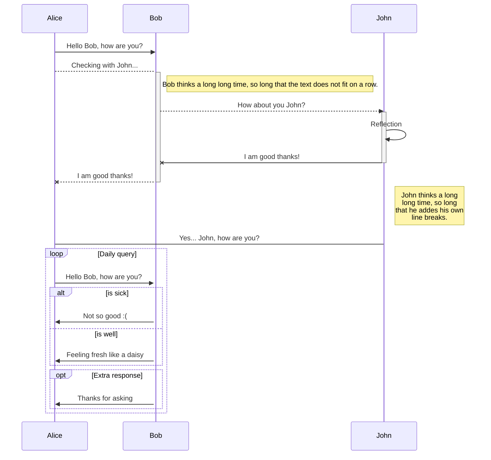
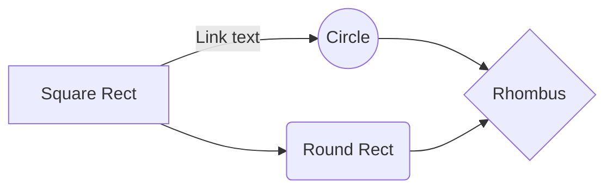

Mermaid demo diagrams

## Sequence diagram

```mermaid
sequenceDiagram
    Alice ->> Bob: Hello Bob, how are you?
    activate Bob
    Bob-->Alice: Checking with John...
    activate Bob
    Note right of Bob: Bob thinks a long long time, so long that the text does not fit on a row.
    Bob-->>John: How about you John?
    activate John
    John ->> John: Reflection
    John -x Bob: I am good thanks!
    deactivate John
    Bob--x Alice: I am good thanks!
    deactivate Bob
    Note right of John: John thinks a long<br/>long time, so long<br/>that he addes his own<br/>line breaks.

    Alice->John: Yes... John, how are you?
    
    loop Daily query
        Alice->>Bob: Hello Bob, how are you?
        alt is sick
            Bob->>Alice: Not so good :(
        else is well
            Bob->>Alice: Feeling fresh like a daisy
        end

        opt Extra response
            Bob->>Alice: Thanks for asking
        end
    end
```

## Flowchart

```mermaid
graph LR
    A[Square Rect] -- Link text --> B((Circle))
    A --> C(Round Rect)
    B --> D{Rhombus}
    C --> D
```

