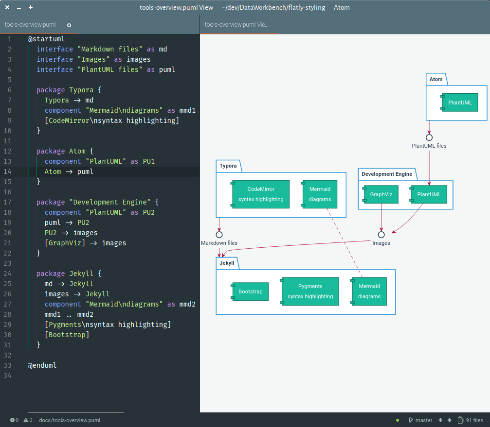

[Atom](https://atom.io/) is an editor for developers. Its core functionality can be extended with packages to work with [PlantUML diagrams](http://plantuml.com):

- [Language support package for PlantUML](https://atom.io/packages/language-plantuml)
- [PlantUML viewer package](https://atom.io/packages/plantuml-viewer)

The result is a relatively easy workflow to produce separate UML diagram files[^1].

These can be saved as images individually. There also is a build target `plantuml` in the Developer Engine that will produce SVG images for all `.pu` and `.puml` files in the `/docs` directory.

---

**Notes**

[^1]: At the time of writing this, the live preview of a PlantUML diagram is unreliable. Also, although Atom and the Developer Engine use the same PlantUML configuration, the layout of the SVG output can be very different.
