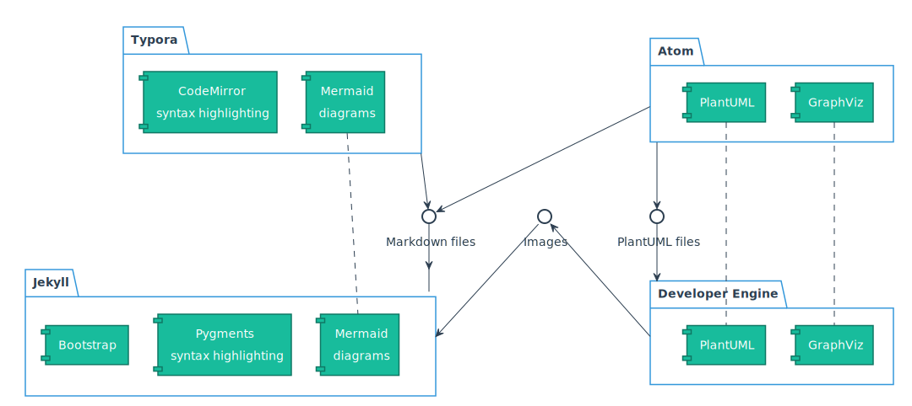

The workflow to generate documentation consists of a few "packages":

- The [Atom editor](atom.html) is useful for code development and to describe UML diagrams using the PlantUML notation.
- The [Typora editor](typora.html) is an easy-to-use editor for Markdown files, with syntax highlighting of code blocks and a simple diagram library.
- The [Developer Engine](devengine.html) is our container with several tools to generate documentation and images from source code.
- [Jekyll](jekyll.html) is the website generator tool included with Github Pages, to generate a complete project documentation website.

*Overview of all components in the styling*