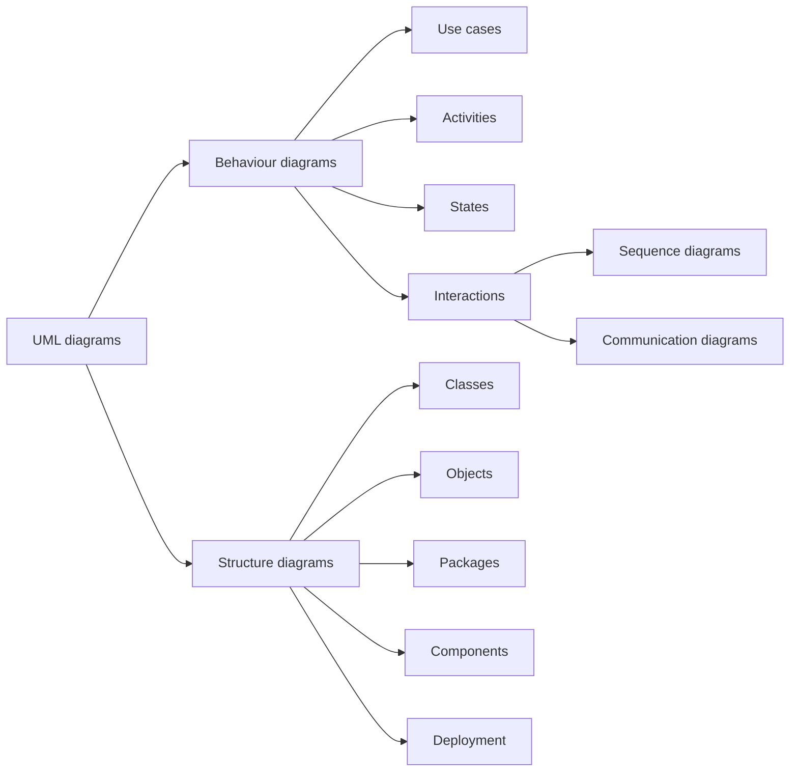
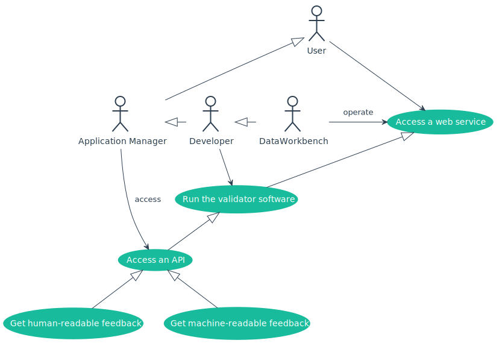
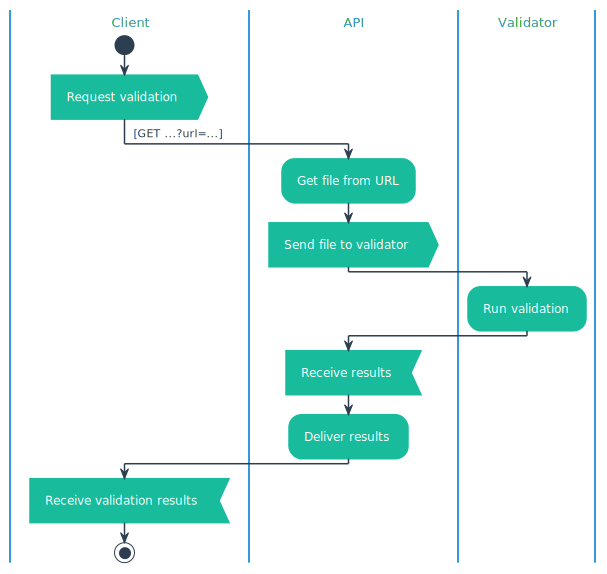

Some diagrams can be generated using Mermaid. For a full palette of UML diagrams, written as plain-text files, we use [PlantUML](http://plantuml.com/). PlantUML can generate SVG images, which can be included in Markdown pages with Typora. The PlantUML config file produces these files using the Flatly colour scheme.

## Use case diagrams

## Sequence diagrams

## Class diagrams

## Activity diagrams

## Component diagrams

## State diagrams

## Object diagrams

## Deployment diagrams
