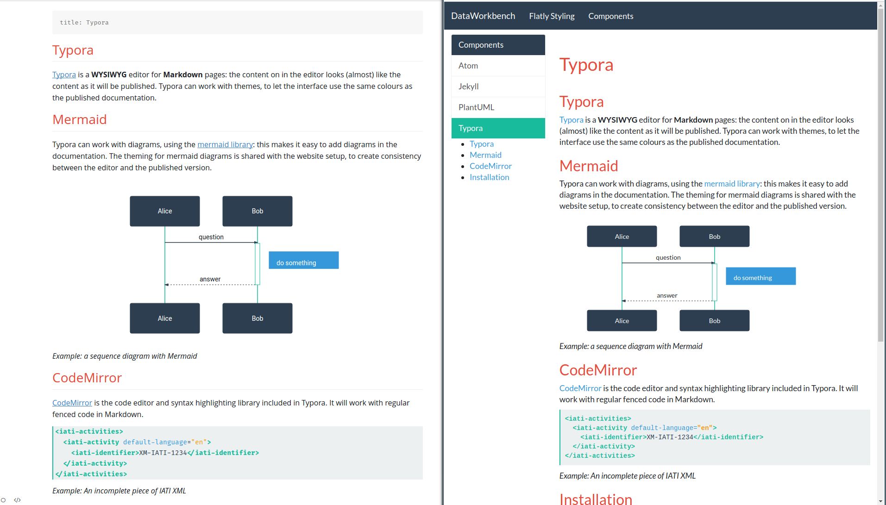
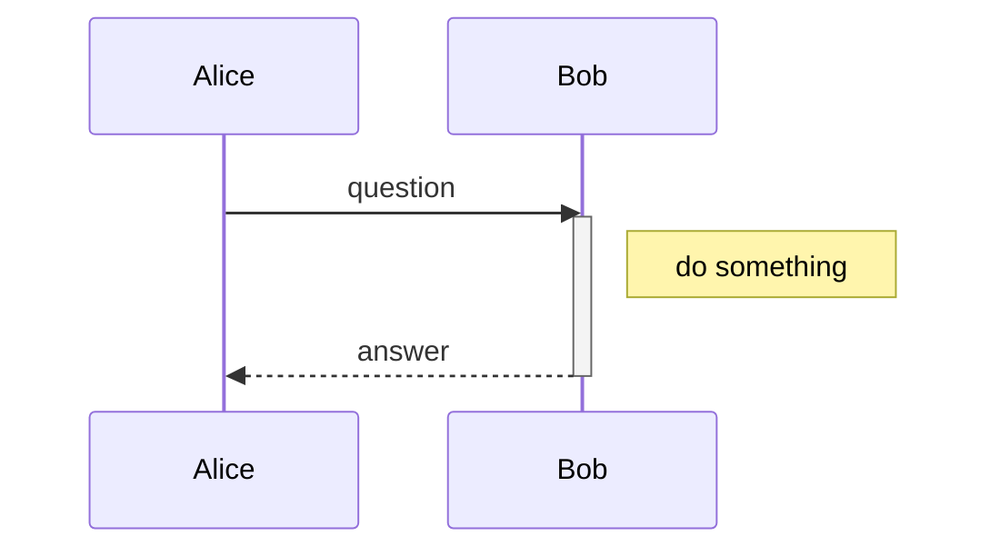

## Typora

[Typora](https://typora.io) is a **WYSIWYG** editor for **Markdown** pages: the content on in the editor looks (almost) like the content as it will be published. Typora can work with themes, to let the interface use the same colours as the published documentation.



*Example: the Typora editor on the left, and the resulting web page on the right*

## Mermaid

Typora can work with diagrams, using the [mermaid library](https://mermaidjs.github.io/): this makes it easy to add diagrams in the documentation. The theming for mermaid diagrams is shared with the website setup, to create consistency between the editor and the published version.



*Example: a sequence diagram with Mermaid*

## CodeMirror

[CodeMirror](https://codemirror.net/) is the code editor and syntax highlighting library included in Typora. It will work with regular fenced code in Markdown.

```xml
<iati-activities>
  <iati-activity default-language="en">
    <iati-identifier>XM-IATI-1234</iati-identifier>
  </iati-activity>
</iati-activities>
```

*Example: An incomplete piece of IATI XML*

## Installation

Copy or link the contents of the `/Typora` folder into `~/.config/Typora/themes`, go to the Themes menu in Typora, and select the Flatly theme.

If you intend to work on the styling, the best way to do this:

- *Copy* the folder `/Typora/flatly` to `~/.config/Typora/themes/flatly`
- *Link* the stylesheets `/Typora/flatly.css` to `~/.config/Typora/themes/flatly.css`

Whenever you edit and compile the source file `/Typora/flatly.scss`, the theme will be updated in Typora after a restart.
